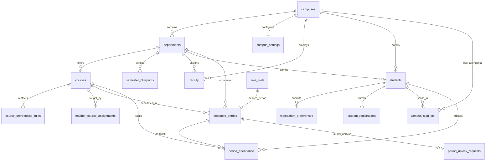
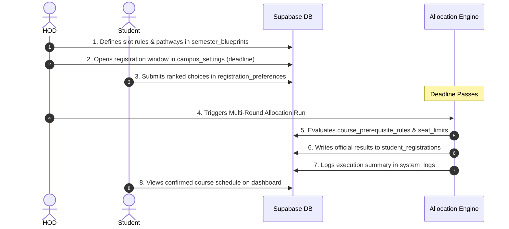
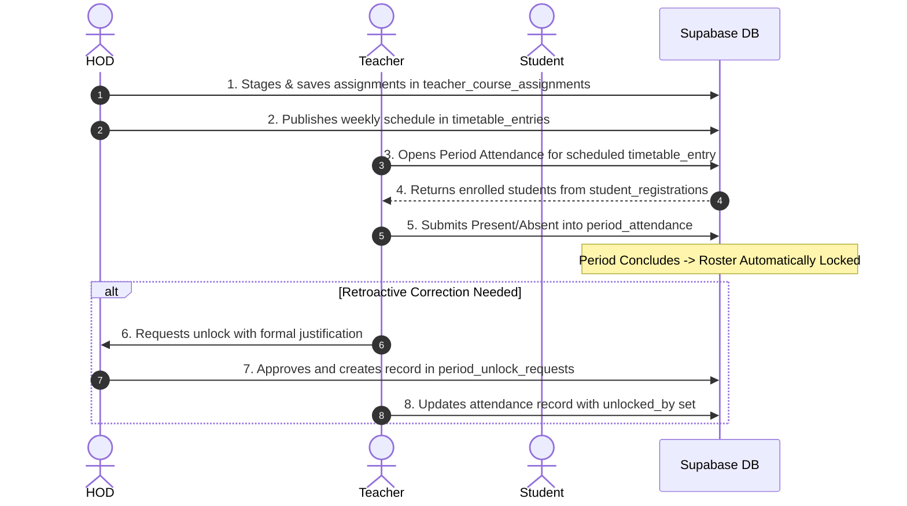

# FYIMP Portal: Complete Database Schema & Column Data Dictionary

This document explains **every database table and column** in the FYIMP Course Registration & Campus Attendance Portal. For each table, it details:
1. **Why the table exists** (the real-world university business logic).
2. **Who uses it** (Actors: Superadmin, Campus Director, HOD, Teacher, Student, Automated Jobs).
3. **Every column explained** (Data type, constraints, what data it holds, and *why* that column is essential).
4. **Key workflows & relationships** (How the data flows between tables).

---

## Table of Contents
- [1. Domain Architecture Overview](#1-domain-architecture-overview)
- [2. Core University Hierarchy & User Identities](#2-core-university-hierarchy--user-identities)
  - [2.1. `campuses`](#21-campuses)
  - [2.2. `campus_settings`](#22-campus_settings)
  - [2.3. `departments`](#23-departments)
  - [2.4. `admins`](#24-admins)
  - [2.5. `faculty`](#25-faculty)
  - [2.6. `students`](#26-students)
- [3. Academic Catalog & Curriculum Architecture](#3-academic-catalog--curriculum-architecture)
  - [3.1. `courses`](#31-courses)
  - [3.2. `course_prerequisite_rules`](#32-course_prerequisite_rules)
  - [3.3. `semester_blueprints`](#33-semester_blueprints)
- [4. Course Registration & Multi-Round Allocation](#4-course-registration--multi-round-allocation)
  - [4.1. `registration_preferences`](#41-registration_preferences)
  - [4.2. `student_registrations`](#42-student_registrations)
- [5. Faculty Assignment & Timetable Scheduling](#5-faculty-assignment--timetable-scheduling)
  - [5.1. `teacher_course_assignments`](#51-teacher_course_assignments)
  - [5.2. `time_slots`](#52-time_slots)
  - [5.3. `timetable_entries`](#53-timetable_entries)
  - [5.4. `timetable_conflicts`](#54-timetable_conflicts)
- [6. Two-Tier Attendance Tracking](#6-two-tier-attendance-tracking)
  - [6.1. `campus_sign_ins`](#61-campus_sign_ins)
  - [6.2. `period_attendance`](#62-period_attendance)
  - [6.3. `period_unlock_requests`](#63-period_unlock_requests)
- [7. Privacy, Governance & System Operations](#7-privacy-governance--system-operations)
  - [7.1. `consent_records`](#71-consent_records)
  - [7.2. `system_logs`](#72-system_logs)
  - [7.3. `schema_migrations`](#73-schema_migrations)
- [8. Compatibility Views](#8-compatibility-views)
  - [8.1. `allocation_runs`](#81-allocation_runs)
  - [8.2. `timetable_generation_jobs`](#82-timetable_generation_jobs)
  - [8.3. `audit_logs`](#83-audit_logs)
- [9. End-to-End Workflow Flowcharts](#9-end-to-end-workflow-flowcharts)

---

## 1. Domain Architecture Overview



---

## 2. Core University Hierarchy & User Identities

### 2.1. `campuses`
* **Why it exists:** Represents the physical university campuses and satellite academic centers. FYIMP is a multi-campus university system (e.g., Main Campus, Satellite Campuses). It establishes the geographical boundaries for geofence-verified attendance and local operational hours.
* **Used by:** Superadmin, Campus Director, Geofence Verification Service, Attendance Engine.

| Column | Type & Constraints | What it Stores | Why it Exists |
| :--- | :--- | :--- | :--- |
| `id` | `UUID PRIMARY KEY DEFAULT gen_random_uuid()` | Unique identifier for the campus. | Immutable internal ID referenced by departments, faculty, students, and attendance tables. |
| `name` | `TEXT NOT NULL UNIQUE` | Full campus name (e.g., `"City Campus"`, `"North Campus"`). | Display name on dashboards, student ID cards, and official reports. |
| `code` | `TEXT NOT NULL UNIQUE` | Short uppercase campus code (e.g., `"CC"`, `"NC"`). | Used in student roll numbers, timetable codes, and campus-specific prefix logic. |
| `center_latitude` | `NUMERIC` | Latitude coordinate of campus center point (e.g., `18.520430`). | Central GPS anchor used to calculate student distance using the Haversine formula. |
| `center_longitude` | `NUMERIC` | Longitude coordinate of campus center point (e.g., `73.856743`). | Central GPS anchor paired with latitude for geofence validation. |
| `radius_meters` | `INTEGER NOT NULL DEFAULT 500` | Allowed geofence radius in meters around campus center. | Defines how close a student's phone must be to the campus to record an authentic sign-in. |
| `morning_cutoff_time` | `TIME NOT NULL DEFAULT '09:30:00'` | Time of day after which morning arrivals are marked `late`. | Enforces student punctuality policy for morning lectures. |
| `midday_split_time` | `TIME NOT NULL DEFAULT '13:30:00'` | Boundary separating morning from evening sessions. | Tells the attendance engine whether a student's sign-in is for Morning or Evening. |
| `evening_cutoff_time` | `TIME NOT NULL DEFAULT '15:30:00'` | Cutoff time for evening session attendance. | Ensures students don't sign in for the evening shift when classes are already finished. |
| `day_end_time` | `TIME NOT NULL DEFAULT '17:00:00'` | Official campus closing time. | Closes all attendance sign-in windows for the day. |
| `created_at` | `TIMESTAMPTZ NOT NULL DEFAULT now()` | Record creation timestamp. | Auditing and system record tracking. |

---

### 2.2. `campus_settings`
* **Why it exists:** Stores global academic parameters and term deadlines specific to each campus. This prevents hardcoding deadlines or credit bounds in application code and allows each campus director to manage their own registration window.
* **Used by:** Campus Director, Superadmin, Registration Window Guards.

| Column | Type & Constraints | What it Stores | Why it Exists |
| :--- | :--- | :--- | :--- |
| `id` | `UUID PRIMARY KEY DEFAULT gen_random_uuid()` | Unique settings record identifier. | Internal primary key. |
| `campus_id` | `UUID NOT NULL UNIQUE REFERENCES campuses(id) ON DELETE CASCADE` | The campus this setting applies to. | Ensures strict 1:1 relationship between a campus and its operational settings. |
| `academic_year` | `TEXT NOT NULL DEFAULT '2026-27'` | Current active academic session (e.g., `'2026-27'`). | Scopes all course registration, timetabling, and attendance queries to the active academic year. |
| `min_credits` | `INTEGER NOT NULL DEFAULT 18` | Minimum semester credits a student must take. | Enforces UGC/NEP 2020 minimum workload regulations. |
| `max_credits` | `INTEGER NOT NULL DEFAULT 26` | Maximum semester credits allowed without overload approval. | Prevents academic burnout and ensures fair distribution of elective course seats. |
| `deadline` | `TIMESTAMPTZ` | Timestamp when the student course registration window closes. | Enforces automatic cutoff; after this moment, students cannot submit or alter choices. |
| `last_promoted_at` | `TIMESTAMPTZ` | Timestamp of the most recent semester promotion execution. | Prevents duplicate semester promotions and tracks when students advanced semesters. |

---

### 2.3. `departments`
* **Why it exists:** Represents academic departments (e.g., Computer Science, Mechanical Engineering, Chemistry). Departments own courses, semester blueprints, faculty, and student cohorts.
* **Used by:** HOD, Faculty, Course Blueprint Engine, Timetable Generator.

| Column | Type & Constraints | What it Stores | Why it Exists |
| :--- | :--- | :--- | :--- |
| `id` | `UUID PRIMARY KEY DEFAULT gen_random_uuid()` | Unique department identifier. | Core foreign key referenced by courses, faculty, students, and timetables. |
| `name` | `TEXT NOT NULL UNIQUE` | Full official department name (e.g., `"Computer Science"`). | Display name on diplomas, transcripts, and faculty assignment interfaces. |
| `code` | `TEXT NOT NULL UNIQUE` | Short uppercase code (e.g., `"CS"`, `"ME"`). | Used in course codes (e.g., `CS101`) and student roll number prefixes. |
| `campus_id` | `UUID NOT NULL REFERENCES campuses(id) ON DELETE CASCADE` | Physical campus housing this department. | Ties academic operations to a physical campus. |
| `created_at` | `TIMESTAMPTZ NOT NULL DEFAULT now()` | Record creation timestamp. | Auditing. |

---

### 2.4. `admins`
* **Why it exists:** Stores administrative identities that manage the FYIMP platform at the university or campus level.
* **Used by:** Superadmin, System Administrators, Auth Guards.

| Column | Type & Constraints | What it Stores | Why it Exists |
| :--- | :--- | :--- | :--- |
| `id` | `UUID PRIMARY KEY REFERENCES auth.users(id) ON DELETE CASCADE` | Matches the Supabase Auth user ID. | Links database row directly to the authenticated credentials in `auth.users`. |
| `full_name` | `TEXT NOT NULL` | Administrator's legal name. | Audit logs and dashboard greetings. |
| `email` | `TEXT NOT NULL UNIQUE` | Administrative login email. | Login verification and automated alert notifications. |
| `role` | `TEXT NOT NULL DEFAULT 'superadmin' CHECK (role IN ('superadmin', 'admin'))` | Access level of the administrator. | Distinguishes full Superadmins (all campuses) from standard Admins (campus-restricted). |
| `created_at` | `TIMESTAMPTZ NOT NULL DEFAULT now()` | When the admin account was created. | Security compliance and credential lifecycle tracking. |

---

### 2.5. `faculty`
* **Why it exists:** Stores all academic staff members, including Heads of Department (HODs), Campus Directors, Teaching Staff, and Course Teachers.
* **Used by:** HOD Dashboard, Course Allocation, Period Attendance Marking, Timetable Generator.

| Column | Type & Constraints | What it Stores | Why it Exists |
| :--- | :--- | :--- | :--- |
| `id` | `UUID PRIMARY KEY REFERENCES auth.users(id) ON DELETE CASCADE` | Matches the Supabase Auth user ID. | Direct 1:1 bond with authenticated user login credentials. |
| `full_name` | `TEXT NOT NULL` | Faculty member's full name. | Displayed on course teacher cards, student timetables, and attendance sheets. |
| `email` | `TEXT NOT NULL UNIQUE` | Institutional email address. | Login identity and official communication destination. |
| `role` | `TEXT NOT NULL CHECK (role IN ('hod', 'teaching_staff', 'campus_director', 'teacher'))` | Specific academic governance role. | Drives role-based access control (RBAC). Determines if user sees HOD canvas, Director reports, or Teacher attendance marking. |
| `department_id` | `UUID REFERENCES departments(id) ON DELETE SET NULL` | Department to which the faculty belongs (NULL for Campus Directors). | Restricts HODs and Teachers to managing only their own department's courses and students. |
| `campus_id` | `UUID NOT NULL REFERENCES campuses(id) ON DELETE CASCADE` | The campus where the faculty is stationed. | Scopes faculty views and timetable assignments to a physical location. |
| `created_at` | `TIMESTAMPTZ NOT NULL DEFAULT now()` | Timestamp of account registration. | Account lifecycle tracking. |

---

### 2.6. `students`
* **Why it exists:** Primary registry of all enrolled students. Maintains their academic progression, home department, and verification credentials.
* **Used by:** Student Portal, Course Allocation, Attendance Tracking, Promotion Engine.

| Column | Type & Constraints | What it Stores | Why it Exists |
| :--- | :--- | :--- | :--- |
| `id` | `UUID PRIMARY KEY REFERENCES auth.users(id) ON DELETE CASCADE` | Matches the Supabase Auth user ID. | Security foundation: ensures a logged-in student can only query their own data via RLS. |
| `full_name` | `TEXT NOT NULL` | Student's full legal name. | Official academic transcripts, grade cards, and attendance registers. |
| `department_id` | `UUID NOT NULL REFERENCES departments(id) ON DELETE CASCADE` | Student's Major/Parent academic department. | Determines which Major courses are mandatory for the student. |
| `campus_id` | `UUID NOT NULL REFERENCES campuses(id) ON DELETE CASCADE` | Student's assigned physical campus. | Used to validate geofenced sign-ins against the correct campus coordinates. |
| `current_semester` | `INTEGER NOT NULL DEFAULT 1 CHECK (current_semester BETWEEN 1 AND 10)` | Current semester of study (1 to 10). | Filters available courses, eligible blueprints, and timetable periods for that student. |
| `cap_application_number` | `TEXT NOT NULL UNIQUE` | Government Centralized Admission Process (CAP) number. | Immutable government identity used during university admission verification. |
| `academic_year_joined` | `TEXT NOT NULL` | Cohort enrollment year (e.g., `'2025-26'`). | Determines graduation requirements, syllabus batch version, and historical reporting. |
| `must_change_password` | `BOOLEAN NOT NULL DEFAULT false` | Flag forcing password update on initial login. | Security defense: forces students with default bulk-imported passwords to set a private credential. |
| `created_at` | `TIMESTAMPTZ NOT NULL DEFAULT now()` | Timestamp of student admission record. | Auditing. |

---

## 3. Academic Catalog & Curriculum Architecture

### 3.1. `courses`
* **Why it exists:** The central catalog of all courses offered across the university under the NEP 2020 / FYIMP framework.
* **Used by:** HOD (Blueprint design), Students (Registration), Timetable Generator (Scheduling), Faculty (Teaching).

| Column | Type & Constraints | What it Stores | Why it Exists |
| :--- | :--- | :--- | :--- |
| `id` | `UUID PRIMARY KEY DEFAULT gen_random_uuid()` | Unique internal course ID. | Used throughout allocations, blueprints, and timetables. |
| `course_code` | `TEXT NOT NULL UNIQUE` | University alphanumeric course code (e.g., `"CS101"`, `"VAC201"`). | Human-readable identifier printed on schedules, hall tickets, and mark sheets. |
| `title` | `TEXT NOT NULL` | Official descriptive course title (e.g., `"Data Structures & Algorithms"`). | Display name on the portal and student transcripts. |
| `department_id` | `UUID NOT NULL REFERENCES departments(id) ON DELETE CASCADE` | Department responsible for creating and teaching this course. | Establishes faculty ownership and departmental credit attribution. |
| `semester` | `INTEGER NOT NULL CHECK (semester BETWEEN 1 AND 10)` | Recommended semester level (1–10). | Aligns the course with the proper academic year and blueprint level. |
| `credits` | `INTEGER NOT NULL CHECK (credits > 0)` | Academic credit weighting (e.g., 2, 3, or 4 credits). | Used to calculate a student's total semester workload and degree completion progress. |
| `category` | `TEXT NOT NULL CHECK (category IN ('DSS', 'DSC', 'DSE', 'VAC', 'SEC', 'MDC', 'MOOC', 'AEC', 'INT', 'FWD', 'RPH', 'CIP'))` | National Education Policy (NEP) FYIMP course classification code. | Categorizes courses into Major (DSC/DSE), Minor (MDC), Ability Enhancement (AEC), Value Added (VAC), Skill Enhancement (SEC), Internship (INT), or Field Work (FWD). |
| `tag` | `TEXT` | Sub-specialization tag (e.g., `"AI"`, `"Cybersecurity"`). | Used by semester blueprints to group courses into specialized learning pathways. |
| `theory_hours_per_week` | `SMALLINT NOT NULL DEFAULT 0` | Scheduled lecture hours per week (e.g., `3`). | Directs the automated timetable generator how many single theory slots to assign. |
| `practical_hours_per_week` | `SMALLINT NOT NULL DEFAULT 0` | Scheduled laboratory hours per week (e.g., `2`). | Directs the timetable generator to find back-to-back linked lab blocks (`is_lab_block`). |
| `seat_limit` | `INTEGER NOT NULL DEFAULT 60` | Maximum student intake capacity for this course. | Enforces capacity constraints during multi-round elective allocation. |
| `prerequisite_course_ids` | `UUID[] DEFAULT '{}'` | Array of course IDs that must be completed prior to taking this course. | Prevents students from registering for advanced courses without prerequisite foundations. |
| `created_at` | `TIMESTAMPTZ NOT NULL DEFAULT now()` | Catalog entry timestamp. | Auditing. |

---

### 3.2. `course_prerequisite_rules`
* **Why it exists:** Powers the automated multi-round allocation algorithm by assigning priority scoring to students applying for high-demand elective courses.
* **Used by:** Background Course Allocation Engine.

| Column | Type & Constraints | What it Stores | Why it Exists |
| :--- | :--- | :--- | :--- |
| `id` | `UUID PRIMARY KEY DEFAULT gen_random_uuid()` | Unique rule ID. | Internal primary key. |
| `course_id` | `UUID NOT NULL REFERENCES courses(id) ON DELETE CASCADE` | The course this scoring rule applies to. | Links priority logic directly to the target course. |
| `rule` | `TEXT NOT NULL CHECK (rule IN ('COMPLETED_COURSE', 'COMPLETED_SEMESTER', 'DEPARTMENT'))` | Type of eligibility condition. | Tells the allocation solver whether to evaluate a prior course completion, semester standing, or home department match. |
| `target` | `TEXT NOT NULL` | Target requirement value (e.g., `"CS101"`, `"3"`, or department UUID). | Value evaluated against student profile during allocation runs. |
| `created_at` | `TIMESTAMPTZ NOT NULL DEFAULT now()` | Rule creation timestamp. | Auditing. |

---

### 3.3. `semester_blueprints`
* **Why it exists:** Configured by the HOD for each semester and department. Defines the curriculum "slots" (Slot 1 to 6) that every student in that semester must register for, specifying whether each slot is a mandatory Major, an open elective, or a pathway-restricted course.
* **Used by:** HOD (Blueprint Tab), Student Registration Form Generator, Allocation Solver.

| Column | Type & Constraints | What it Stores | Why it Exists |
| :--- | :--- | :--- | :--- |
| `id` | `UUID PRIMARY KEY DEFAULT gen_random_uuid()` | Unique blueprint identifier. | Primary key. |
| `department_id` | `UUID NOT NULL REFERENCES departments(id) ON DELETE CASCADE` | Department this blueprint belongs to. | Ensures each department designs its own semester curriculum structure. |
| `semester` | `INTEGER NOT NULL CHECK (semester BETWEEN 1 AND 8)` | Semester number (1 to 8). | Combined with `department_id`, forms a unique constraint per department-semester pair. |
| `min_credits` | `INTEGER NOT NULL DEFAULT 18` | Minimum total credits required for this semester. | Validates that student selections meet the departmental graduation benchmark. |
| `max_credits` | `INTEGER NOT NULL DEFAULT 26` | Maximum credits permitted for this semester. | Protects students from registering for too many heavy courses simultaneously. |
| `slot_1_name` ... `slot_6_name` | `TEXT` | Human-readable name for each slot (e.g., `"Major Core 1"`, `"Open Elective"`). | Rendered on the student registration UI as section headers. |
| `slot_1_rule` ... `slot_6_rule` | `TEXT` | Selection rule (e.g., `'CATEGORY'`, `'FIXED_COURSE'`, `'PATHWAY'`). | Tells the UI how to restrict choices: show all VAC courses, lock in a specific course, or filter by pathway. |
| `slot_1_target` ... `slot_6_target` | `TEXT` | Rule parameter (e.g., `'DSC'`, `'CS201'`, `'AI'`). | The specific category code, course ID, or pathway tag enforced by the slot rule. |
| `pathways` | `JSONB` | Array of specialization tracks (e.g., `[{"id": "ai", "name": "Artificial Intelligence"}]`). | Allows students to choose a focus track that automatically filters elective course offerings. |
| `created_at` | `TIMESTAMPTZ NOT NULL DEFAULT now()` | Blueprint design timestamp. | Version tracking. |

---

## 4. Course Registration & Multi-Round Allocation

### 4.1. `registration_preferences`
* **Why it exists:** Captures students' submitted choices during an open registration window. When courses have seat limits (e.g., 60 seats for 120 applicants), students rank their 1st, 2nd, and 3rd choices. This table stores their submitted wishlist prior to allocation.
* **Used by:** Student Portal (Course Registration), Background Multi-Round Allocation Engine.

| Column | Type & Constraints | What it Stores | Why it Exists |
| :--- | :--- | :--- | :--- |
| `id` | `UUID PRIMARY KEY DEFAULT gen_random_uuid()` | Unique preference submission ID. | Primary key. |
| `student_id` | `UUID NOT NULL REFERENCES students(id) ON DELETE CASCADE` | The student submitting preferences. | Identifies who owns these elective choices. |
| `campus_id` | `UUID NOT NULL REFERENCES campuses(id) ON DELETE CASCADE` | Campus of the student. | Enables batch allocation runs scoped by campus. |
| `semester` | `SMALLINT NOT NULL` | Semester the student is registering for. | Ensures preferences are tied to the appropriate academic term. |
| `academic_year` | `TEXT NOT NULL` | Academic session (e.g., `'2026-27'`). | Distinguishes current preferences from past historical terms. |
| `pathway_id` | `TEXT` | Specialization pathway chosen by student (e.g., `'ai'`). | Restricts pathway-specific course assignments. |
| `preferences` | `JSONB NOT NULL DEFAULT '[]'` | Ordered array of course preferences per slot: `[{"slot": 1, "choices": ["uuid-1", "uuid-2"]}]`. | Full ranked wishlist used by Gale-Shapley / multi-round seat allocation algorithms. |
| `allocation_metadata` | `JSONB DEFAULT '{}'` | Algorithm run details, assigned rank, and tie-breaker scores. | Provides transparency if a student asks why they received their 2nd choice instead of 1st. |
| `submitted_at` | `TIMESTAMPTZ NOT NULL DEFAULT now()` | Exact timestamp when student finalized submission. | Tie-breaker criterion: students who submitted earlier can be given precedence. |
| `created_at` / `updated_at` | `TIMESTAMPTZ NOT NULL DEFAULT now()` | Auditing timestamps. | Tracks modifications made prior to the deadline. |

---

### 4.2. `student_registrations`
* **Why it exists:** Represents the **official, confirmed registration** of a student into courses for a semester. Once the allocation engine finishes or an HOD confirms enrollment, the final assigned courses are written here.
* **Used by:** Student Dashboard, Period Attendance Registers, Grade Cards, Transcripts.

| Column | Type & Constraints | What it Stores | Why it Exists |
| :--- | :--- | :--- | :--- |
| `id` | `UUID PRIMARY KEY DEFAULT gen_random_uuid()` | Official registration record ID. | Primary key. |
| `student_id` | `UUID NOT NULL REFERENCES students(id) ON DELETE CASCADE` | The registered student. | Links confirmed courses to the student's academic record. |
| `campus_id` | `UUID NOT NULL REFERENCES campuses(id) ON DELETE CASCADE` | The campus where the student takes classes. | Scoping and reporting. |
| `semester` | `INTEGER NOT NULL CHECK (semester BETWEEN 1 AND 8)` | Semester level for this registration. | Academic term identifier. |
| `academic_year` | `TEXT NOT NULL` | Academic year (e.g., `'2026-27'`). | Combined with `student_id` and `semester`, forms a unique enrollment constraint. |
| `slot_1_course_id` ... `slot_6_course_id` | `UUID REFERENCES courses(id) ON DELETE SET NULL` | Confirmed course enrolled in each curriculum slot. | The definitive schedule of courses the student must attend and be graded on. |
| `total_credits` | `INTEGER NOT NULL DEFAULT 0 CHECK (total_credits >= 0)` | Sum of credits across all assigned courses. | Checked against degree audit requirements. |
| `submitted_at` | `TIMESTAMPTZ NOT NULL DEFAULT now()` | Timestamp when registration was confirmed. | Legal academic audit timestamp. |
| `pathway_id` | `TEXT` | Confirmed pathway chosen by student. | Track tracking. |
| `selections` / `selected_courses` | `JSONB` | Snapshot of enrolled course metadata at time of confirmation. | Preserves historical course names/credits even if course details are edited years later. |
| `allocation_metadata` | `JSONB DEFAULT '{}'` | Allocation engine execution run ID and round number. | Traceability. |

---

## 5. Faculty Assignment & Timetable Scheduling

### 5.1. `teacher_course_assignments`
* **Why it exists:** Records which faculty member is assigned to teach which course in a department. An HOD uses the interactive drag-and-drop canvas to pair teachers with courses.
* **Used by:** HOD Dashboard, Teacher Attendance Marking, Timetable Generator.

| Column | Type & Constraints | What it Stores | Why it Exists |
| :--- | :--- | :--- | :--- |
| `id` | `UUID PRIMARY KEY DEFAULT gen_random_uuid()` | Unique assignment identifier. | Primary key. |
| `teacher_id` | `UUID NOT NULL REFERENCES faculty(id) ON DELETE CASCADE` | Faculty member assigned to teach. | Authorizes this specific teacher to take attendance for the course. |
| `course_id` | `UUID NOT NULL REFERENCES courses(id) ON DELETE CASCADE` | Course being taught. | Links teacher to the syllabus and enrolled student list. |
| `assigned_by` | `UUID REFERENCES faculty(id) ON DELETE SET NULL` | HOD who made this assignment. | Accountability and governance auditing. |
| `assigned_at` | `TIMESTAMPTZ NOT NULL DEFAULT now()` | When the assignment was made or saved in batch. | Auditing. |
| `academic_year` | `TEXT` | Session during which this assignment is active. | Prevents previous semester assignments from bleeding into new academic terms. |
| `semester` | `SMALLINT` | Semester number (1 to 10). | Scoping. |
| `created_at` | `TIMESTAMPTZ NOT NULL DEFAULT now()` | Record creation timestamp. | Auditing. |

---

### 5.2. `time_slots`
* **Why it exists:** Represents the master weekly timetable grid (e.g., Monday Period 1: 08:30–09:30). It is the foundational time matrix onto which classes are scheduled.
* **Used by:** Timetable Generator, Student & Faculty Timetables, Period Attendance marking.

| Column | Type & Constraints | What it Stores | Why it Exists |
| :--- | :--- | :--- | :--- |
| `id` | `UUID PRIMARY KEY DEFAULT gen_random_uuid()` | Unique time slot identifier. | Referenced by timetable entries. |
| `day_of_week` | `SMALLINT NOT NULL CHECK (day_of_week BETWEEN 1 AND 6)` | Day of the week: `1` = Monday ... `6` = Saturday. | Determines which day the class meets. |
| `period_number` | `SMALLINT NOT NULL CHECK (period_number BETWEEN 1 AND 10)` | Period index of the day (Period 1 to 10). | Establishes chronological sequence of periods within a day. |
| `start_time` | `TIME NOT NULL` | Exact start time (e.g., `09:30:00`). | Displayed on student schedules and validates if attendance is marked on time. |
| `end_time` | `TIME NOT NULL` | Exact end time (e.g., `10:30:00`). | Establishes period conclusion. |
| `is_lab_block` | `BOOLEAN NOT NULL DEFAULT false` | Whether this period is designated for lab/practical work. | Practical classes require extended 2-hour blocks instead of 1-hour lectures. |
| `lab_pair_with` | `UUID REFERENCES time_slots(id) ON DELETE SET NULL` | Self-referencing FK linking to the consecutive lab period. | Pairs Period 1 & 2 together so lab sessions are never split across non-adjacent periods. |

---

### 5.3. `timetable_entries`
* **Why it exists:** The scheduled lecture or lab session. Binds a **Course**, a **Department**, a **Time Slot**, and an **Academic Year** together into an official class schedule.
* **Used by:** Timetable Viewer, Period Attendance Marking, Conflict Detection.

| Column | Type & Constraints | What it Stores | Why it Exists |
| :--- | :--- | :--- | :--- |
| `id` | `UUID PRIMARY KEY DEFAULT gen_random_uuid()` | Unique scheduled class entry ID. | The exact entity that teachers mark attendance against. |
| `academic_year` | `TEXT NOT NULL` | Academic year (e.g., `'2026-27'`). | Scoping. |
| `semester` | `SMALLINT NOT NULL` | Semester level of the class. | Scoping. |
| `course_id` | `UUID NOT NULL REFERENCES courses(id) ON DELETE CASCADE` | Course being taught in this period. | Identifies subject matter and enrolled students. |
| `department_id` | `UUID NOT NULL REFERENCES departments(id) ON DELETE CASCADE` | Department hosting the class. | Departmental timetable ownership. |
| `time_slot_id` | `UUID NOT NULL REFERENCES time_slots(id) ON DELETE CASCADE` | Master time slot assigned to this class. | Links class to day, period number, and start/end time. |
| `is_lab_block` | `BOOLEAN NOT NULL DEFAULT false` | Indicates if this entry is part of a 2-hour laboratory block. | Scheduling constraints and facility allocation. |
| `status` | `TEXT NOT NULL DEFAULT 'draft' CHECK (status IN ('draft', 'generated', 'published'))` | Publication lifecycle status. | Allows administrators to generate and review draft timetables before making them visible to students (`'published'`). |
| `session_type` | `TEXT DEFAULT 'theory'` | Session format (`'theory'`, `'lab'`, `'tutorial'`). | Classroom assignment logic. |
| `published_at` | `TIMESTAMPTZ` | Timestamp when the timetable was published. | Version control and notification triggering. |
| `created_at` | `TIMESTAMPTZ NOT NULL DEFAULT now()` | Record creation timestamp. | Auditing. |

---

### 5.4. `timetable_conflicts`
* **Why it exists:** Records scheduling clashes detected by the automated CSP (Constraint Satisfaction Problem) timetable generator (e.g., two courses taken by the same cohort scheduled in the same time slot).
* **Used by:** HOD / Administrator Timetable Resolution Screen.

| Column | Type & Constraints | What it Stores | Why it Exists |
| :--- | :--- | :--- | :--- |
| `id` | `UUID PRIMARY KEY DEFAULT gen_random_uuid()` | Unique conflict identifier. | Primary key. |
| `academic_year` / `semester` | `TEXT` / `SMALLINT NOT NULL` | Session and semester. | Scoping. |
| `course_id` | `UUID NOT NULL REFERENCES courses(id) ON DELETE CASCADE` | The course experiencing the clash. | Identifies affected course. |
| `blocking_course_id` | `UUID REFERENCES courses(id) ON DELETE SET NULL` | The competing course creating the clash. | Pinpoints the root cause of the conflict. |
| `reason` | `TEXT NOT NULL` | Descriptive conflict diagnosis (e.g., `"Cohort overlap"`). | Informs the HOD why the automated scheduler could not place the course. |
| `conflicting_student_count` | `INTEGER DEFAULT 0` | Number of students enrolled in both courses simultaneously. | Helps administrators prioritize which conflict has the highest student impact. |
| `resolved` | `BOOLEAN NOT NULL DEFAULT false` | Resolution toggle. | Tracks whether the HOD has manually fixed the clash. |
| `created_at` | `TIMESTAMPTZ NOT NULL DEFAULT now()` | Conflict log timestamp. | Auditing. |

---

## 6. Two-Tier Attendance Tracking

### 6.1. `campus_sign_ins`
* **Why it exists:** Tier-1 attendance. Verifies daily physical presence on campus using mobile GPS against the campus geofence coordinates. **Privacy-by-design:** Coordinates are verified on the fly and discarded; the database never stores latitude or longitude tracking trails.
* **Used by:** Student Mobile App, Campus Director Attendance Dashboard.

| Column | Type & Constraints | What it Stores | Why it Exists |
| :--- | :--- | :--- | :--- |
| `id` | `UUID PRIMARY KEY DEFAULT gen_random_uuid()` | Unique sign-in record ID. | Primary key. |
| `student_id` | `UUID NOT NULL REFERENCES students(id) ON DELETE CASCADE` | Student signing in. | Attendance attribution. |
| `campus_id` | `UUID NOT NULL REFERENCES campuses(id) ON DELETE CASCADE` | Campus where sign-in was validated. | Multi-campus validation. |
| `session_type` | `TEXT NOT NULL CHECK (session_type IN ('morning', 'evening'))` | Shift indicator (`'morning'` or `'evening'`). | Supports morning arrival and evening departure tracking. |
| `signed_in_at` | `TIMESTAMPTZ NOT NULL DEFAULT now()` | Exact timestamp of verification. | Verifies exact arrival minute. |
| `signed_in_date` | `DATE NOT NULL DEFAULT current_date (IST)` | Calendar date of attendance in IST. | Enforces a strict unique constraint: only 1 morning and 1 evening sign-in per student per day. |
| `location_accuracy_meters` | `NUMERIC NOT NULL DEFAULT 10` | GPS signal horizontal accuracy reported by device (e.g., `12m`). | Flags suspicious GPS spoofers if reported accuracy is unnaturally high or low. |
| `status` | `TEXT NOT NULL CHECK (status IN ('on_time', 'late', 'early_leave'))` | Arrival classification. | Automated punctuality scoring based on campus cutoff times. |
| `source` | `TEXT NOT NULL DEFAULT 'gps' CHECK (source IN ('gps', 'manual_staff'))` | Verification method (`'gps'` or staff override). | Distinguishes normal mobile phone check-ins from manual security gate overrides. |
| `created_at` | `TIMESTAMPTZ NOT NULL DEFAULT now()` | Insertion timestamp. | Auditing. |

---

### 6.2. `period_attendance`
* **Why it exists:** Tier-2 attendance. Records subject-wise attendance marked by the course teacher during each specific lecture or lab period.
* **Used by:** Course Teachers (Attendance Marking), Students (Subject Attendance Report), HOD.

| Column | Type & Constraints | What it Stores | Why it Exists |
| :--- | :--- | :--- | :--- |
| `id` | `UUID PRIMARY KEY DEFAULT gen_random_uuid()` | Unique individual student attendance record. | Primary key. |
| `timetable_slot_id` | `UUID NOT NULL REFERENCES timetable_entries(id) ON DELETE CASCADE` | The specific class period being conducted. | Ties attendance directly to the official schedule and room. |
| `student_id` | `UUID NOT NULL REFERENCES students(id) ON DELETE CASCADE` | The student whose attendance is recorded. | Individual student tracking. |
| `course_id` | `UUID NOT NULL REFERENCES courses(id) ON DELETE CASCADE` | The course being taught. | Enables 75% subject-wise attendance threshold calculations for exam eligibility. |
| `marked_by` | `UUID NOT NULL REFERENCES auth.users(id) ON DELETE CASCADE` | User ID of teacher or staff member who marked attendance. | Non-repudiation: guarantees an audit trail of who submitted the attendance. |
| `status` | `TEXT NOT NULL CHECK (status IN ('present', 'absent'))` | Attendance outcome (`'present'` or `'absent'`). | The primary academic compliance datum. |
| `marked_at` | `TIMESTAMPTZ NOT NULL DEFAULT now()` | Timestamp when the teacher submitted the roster. | Verifies attendance was taken during the actual class period. |
| `attendance_date` | `DATE NOT NULL DEFAULT CURRENT_DATE` | Calendar date of class. | Prevents duplicate marking for the same student, slot, and date. |
| `is_late_entry` | `BOOLEAN NOT NULL DEFAULT false` | Whether student entered after the lecture began. | Allows teacher to record tardiness. |
| `unlocked_by` | `UUID REFERENCES auth.users(id) ON DELETE SET NULL` | ID of HOD/Admin who authorized an edit after lock. | Tracks if attendance was retroactively modified under an approved unlock request. |

---

### 6.3. `period_unlock_requests`
* **Why it exists:** Academic integrity lock. Attendance rosters automatically freeze after class ends. If a teacher made a mistake or a student had an excused medical absence, this table stores the formal unlock request and reason approved by the HOD.
* **Used by:** HOD, Course Teachers, University Audit Committee.

| Column | Type & Constraints | What it Stores | Why it Exists |
| :--- | :--- | :--- | :--- |
| `id` | `UUID PRIMARY KEY DEFAULT gen_random_uuid()` | Unique unlock request ID. | Primary key. |
| `timetable_slot_id` | `UUID NOT NULL REFERENCES timetable_entries(id) ON DELETE CASCADE` | The locked timetable period requesting reopening. | Identifies which class roster to unlock. |
| `unlocked_by` | `UUID NOT NULL REFERENCES auth.users(id) ON DELETE CASCADE` | Administrator / HOD granting permission. | Ensures only authorized academic heads can reopen locked registers. |
| `unlocked_at` | `TIMESTAMPTZ NOT NULL DEFAULT now()` | When the unlock was granted. | Limits the unlock window (e.g., 2 hours to make corrections). |
| `reason` | `TEXT NOT NULL` | Official academic justification (e.g., `"Medical certificate verified by HOD"`). | Compliance defense against arbitrary attendance manipulation. |
| `created_at` | `TIMESTAMPTZ NOT NULL DEFAULT now()` | Request creation timestamp. | Auditing. |

---

## 7. Privacy, Governance & System Operations

### 7.1. `consent_records`
* **Why it exists:** Ensures full compliance with India's **Digital Personal Data Protection (DPDP) Act 2023**. Records explicit user agreement to the portal's privacy policy and data processing terms prior to accessing services.
* **Used by:** DPDP Compliance Engine, User Login Middleware.

| Column | Type & Constraints | What it Stores | Why it Exists |
| :--- | :--- | :--- | :--- |
| `id` | `UUID PRIMARY KEY DEFAULT gen_random_uuid()` | Unique consent record ID. | Primary key. |
| `user_id` | `UUID NOT NULL REFERENCES auth.users(id) ON DELETE CASCADE` | Student or faculty member giving consent. | Links consent to an authenticated citizen account. |
| `policy_version` | `TEXT NOT NULL DEFAULT 'v1.0'` | Version string of terms accepted (e.g., `'v1.0'`, `'v2.0'`). | If the privacy policy is updated, the system can prompt users who only consented to older versions. |
| `accepted_at` | `TIMESTAMPTZ NOT NULL DEFAULT now()` | Exact moment user clicked "I Accept". | Irrefutable proof of consent timestamp. |
| `ip_address` | `INET` | Client IP address at time of acceptance. | Digital forensics / evidentiary audit trail required by data protection regulations. |
| `user_agent` | `TEXT` | Browser/device user agent string. | Device proof under legal scrutiny. |
| `created_at` | `TIMESTAMPTZ NOT NULL DEFAULT now()` | Record timestamp. | Auditing. |

---

### 7.2. `system_logs`
* **Why it exists:** The unified, high-performance operational ledger for the entire platform. Combines security audit events, asynchronous background jobs (course allocation runs, timetable generation), and critical server errors into a single partitioned table.
* **Used by:** Superadmin Audit Dashboard, Background Job Schedulers, Error Monitoring.

| Column | Type & Constraints | What it Stores | Why it Exists |
| :--- | :--- | :--- | :--- |
| `id` | `UUID PRIMARY KEY DEFAULT gen_random_uuid()` | Unique log entry ID. | Primary key. |
| `log_type` | `TEXT NOT NULL CHECK (log_type IN ('audit_event', 'timetable_job', 'allocation_run', 'server_error'))` | Category of event. | Drives routing, indexing, and virtual view filtering. |
| `status` | `TEXT NOT NULL CHECK (status IN ('queued', 'running', 'completed', 'failed', 'success', 'failure'))` | Operational status of the event or job. | Allows UI to show live spinners, progress bars, or error badges. |
| `progress` | `SMALLINT DEFAULT 0 CHECK (progress BETWEEN 0 AND 100)` | Completion percentage for long background jobs (0–100%). | Powers real-time progress bars during 5-minute allocation or scheduling runs. |
| `error_message` | `TEXT` | Brief human-readable error summary. | Rapid error diagnosis in dashboards. |
| `error_stack` | `TEXT` | Full technical execution stack trace. | Enables developers to debug exceptions without opening production servers. |
| `campus_id` | `UUID REFERENCES campuses(id) ON DELETE CASCADE` | Campus context of the event. | Enables campus-filtered audit queries. |
| `academic_year` / `semester` | `TEXT` / `SMALLINT` | Academic session and semester. | Scoping. |
| `user_id` / `user_role` | `UUID` / `TEXT` | Actor who performed the action. | Attribution (e.g., "HOD Dr. Sharma modified course CS101"). |
| `event_type` / `action` | `TEXT` | Name of action (e.g., `'FACULTY_ASSIGNED'`, `'TIMETABLE_PUBLISHED'`). | Structured classification for compliance audits. |
| `resource_type` / `resource_id` | `TEXT` / `UUID` | Entity affected (e.g., `'course'`, `'timetable_entry'`). | Deep-linking to affected entities. |
| `ip_address` / `user_agent` / `route` | `INET` / `TEXT` / `TEXT` | Network request metadata (e.g., `POST /api/assignments/batch-assign`). | Security forensics. |
| `metadata` | `JSONB DEFAULT '{}'` | Structured payload containing job outputs, stats, or diffs. | Stores rich results (e.g., count of allocated students, conflict summaries). |
| `started_at` / `completed_at` | `TIMESTAMPTZ` | Job duration boundaries. | Performance profiling and SLA tracking. |
| `created_at` / `updated_at` | `TIMESTAMPTZ NOT NULL DEFAULT now()` | Insertion and modification timestamps. | Auditing. |

---

### 7.3. `schema_migrations`
* **Why it exists:** Version control ledger for database migrations. Ensures that automated CI/CD deployment pipelines apply SQL migration scripts exactly once and in the correct chronological sequence.
* **Used by:** Automated Database Migration Runners, Backend Bootstrap.

| Column | Type & Constraints | What it Stores | Why it Exists |
| :--- | :--- | :--- | :--- |
| `version` | `VARCHAR(255) PRIMARY KEY` | Unique migration timestamp or version key (e.g., `'20260925_harden_rls'`). | Guarantees uniqueness and establishes execution order. |
| `name` | `VARCHAR(255) NOT NULL` | Descriptive name of migration. | Human-readable explanation of schema modifications. |
| `applied_at` | `TIMESTAMPTZ NOT NULL DEFAULT now()` | Timestamp when migration was executed on the database. | Deployment history and rollback tracking. |

---

## 8. Compatibility Views

The database includes three virtual SQL views that query `system_logs`. These ensure full backward compatibility with legacy endpoints without maintaining redundant physical tables:

### 8.1. `allocation_runs`
```sql
SELECT id, campus_id, academic_year, semester, status,
       user_id AS triggered_by, started_at AS triggered_at,
       (metadata->>'total_students')::int AS total_students,
       (metadata->>'fully_allocated')::int AS fully_allocated,
       (metadata->>'partially_allocated')::int AS partially_allocated,
       (metadata->>'unallocated')::int AS unallocated,
       metadata->'summary' AS summary, error_message, started_at, completed_at
FROM system_logs WHERE log_type = 'allocation_run';
```
* **Why it exists:** Provides a clean interface for HODs and Directors to review past course allocation results, seats filled, and unallocated students without parsing raw JSON logs.

### 8.2. `timetable_generation_jobs`
```sql
SELECT id, campus_id, academic_year, semester, status, progress, error_message,
       user_id AS triggered_by, metadata->'config' AS config,
       started_at, completed_at, created_at, updated_at
FROM system_logs WHERE log_type = 'timetable_job';
```
* **Why it exists:** Powers the real-time polling hook during automated timetable creation, showing current job status, progress percentage, and configuration settings.

### 8.3. `audit_logs`
```sql
SELECT id, event_type, user_id, user_role, action, resource_type,
       resource_id, status, error_message, metadata, ip_address, created_at
FROM system_logs WHERE log_type = 'audit_event';
```
* **Why it exists:** Exposes a standard security and compliance view for university auditors to inspect who modified grades, changed faculty assignments, or published timetables.

---

## 9. End-to-End Workflow Flowcharts

### 9.1. Course Registration to Final Enrollment


### 9.2. Faculty Assignment & Period Attendance


---
*Generated for the FYIMP Course Registration & Campus Attendance Portal.*
