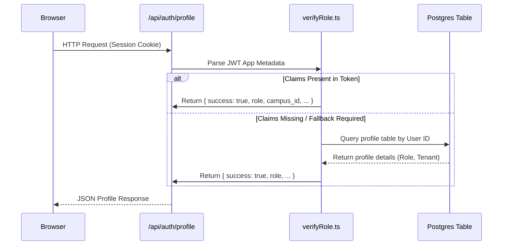

# FYIMP Course Registration Portal — Security Architecture & Functioning Report

This report outlines the design patterns, security controls, tenant isolation guidelines, and architectural guarantees implemented in the Kannur University Five Year Integrated Masters Programme (FYIMP) Course Registration Portal.

---

## 1. System Architecture & Boundaries

The portal is designed with a strict **Server-First Architecture** utilizing Next.js App Router (React Server Components + API Handlers) backed by Supabase.

```mermaid
graph TD
    Client[Browser / Client Components] -->|HTTP Requests| NextAPI[Next.js Server API Routes]
    Client -->|Pageshow / Mount Sync| ProfileAPI[/api/auth/profile]
    NextAPI -->|verifyRole.ts JWT Claims Validation| SecureAuth{Authorized?}
    SecureAuth -->|Yes: Server-to-Server Admin Key| Postgres[(Supabase Database)]
    SecureAuth -->|No| Unauthorized[401 / 403 JSON Error]
```

### Core Security Guarantees
1. **No Direct Client Database Access**: Client components do not execute raw queries. All operations route through server-side handlers (`/api/*`), ensuring the Next.js API layer acts as the absolute gateway.
2. **Synchronous JWT Claims Verification**: Server API handlers verify roles, campus mappings, and department scopes using cryptographic JWT claims directly extracted from HTTP cookies.
3. **Defense-in-Depth Session Synchronization**: Client-side pages (Home and Login) actively check `/api/auth/profile` on mount and bfcache (pageshow) transitions to auto-redirect authenticated users.

---

## 2. Threat Mitigation & Security Controls

| Threat Vector | Mitigation Strategy | Implementation Details |
| :--- | :--- | :--- |
| **Cross-Tenant Data Disclosures** | Campus-scoped lookup constraints | `/api/faculty/courses` dynamically queries the faculty member's campus ID and only returns departments/courses belonging to that campus. |
| **Brute Force & Mutation Abuse** | Adaptive rate-limiting layers | Rate limiters configured in `rateLimiter.ts`: `loginLimiter` (5 req/min), `changePasswordLimiter` (10 req/min), and `adminCrudLimiter` (60 req/min) for HOD/Admin write operations. |
| **XSS & Clickjacking** | Cryptographic security headers | `next.config.ts` injects a Content Security Policy (CSP), `X-Frame-Options: DENY`, `X-Content-Type-Options: nosniff`, and HSTS. |
| **Stale Authentication Access** | Caching rules & pageshow listeners | `Cache-Control: no-store, must-revalidate` applied in next config for root/login routes, backed by client-side event listeners checking session status. |
| **Course Schedule Tampering** | Server-side semester assertions | `submitCourses.ts` validates that all submitted elective/slot options belong to the student's database-enforced `current_semester` before enrollment write. |

---

## 3. Detailed Authorization Flows

### Role-Based Access Control (RBAC)
User authorization mappings are managed inside `verifyRole.ts` using JWT claims and database fallbacks:



- **Student Mismatches**: If a user attempts to access `/dashboard/hod` but has a `student` role, the layout catches the `403` status, reads the `actualRole` claim, and redirects them to `/dashboard/student`.
- **Redirect Loops Protection**: If the mapped fallback route is identical to the requested layout, the system redirects to `/login` immediately to prevent infinite redirects.

---

## 4. Database Security Guidelines

To guarantee safety even if the Next.js API layer is compromised, Postgres Row-Level Security (RLS) must be enabled on all tables:

1. **Table Policies**:
   - `students`: Read allowed if `auth.uid() = id`.
   - `faculty`: Read allowed if `auth.uid() = id` or the reader is the Campus Director / HOD on the same `campus_id`.
   - `student_registrations`: Read/Write allowed if `auth.uid() = student_id`.
2. **Bypass Guard**:
   - All server API calls utilize the `supabaseAdmin` client (service role) *only after* performing identity verification via `verifyRole.ts`.

---

## 5. Testing & Verification System

Automated checks are run inside `vitest` to guarantee no regressions in core security functions:
- **Slot Rules Validation**: Verifies that Fixed, Department Restricted, Excluded Department, and Global Basket options are dynamically resolved.
- **Authorization Constraints**: Asserts that invalid user tokens return correct `401`/`403` errors.
- **Submission Semester Check**: Asserts that registration fails if a student attempts to enroll in a course outside their active semester.

*To run tests locally:*
```bash
npx vitest run
```
